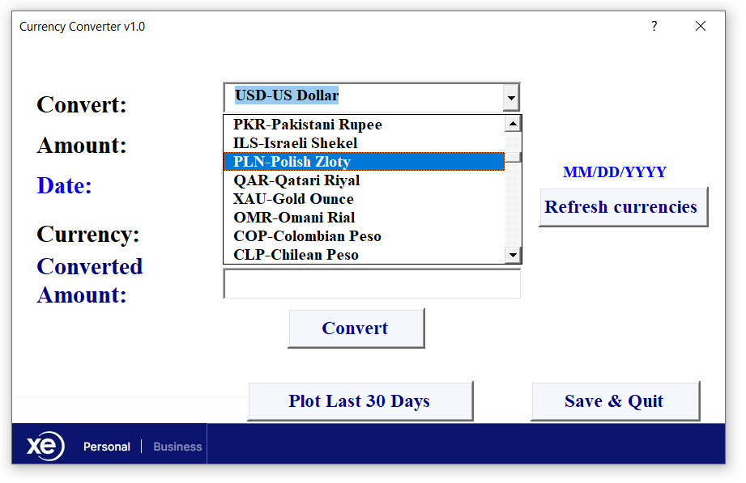
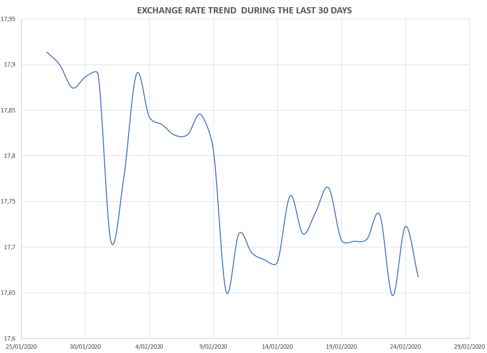

# Currency converter

This is a desktop app developed with Visual Basic for Applications. The purpose of the project was to create a currency converter that works with real-time data fetched from the following website (currency API): https://www.xe.com/currencytables/?from=USD&date=2021-07-14 

 

 

 
 

The app lets the user track the currency exchange behaviour and compare the converted values with a log of estimations and a graphical analysis.
The user form is executed in runtime in Excel when the user clicks an action button in the main worksheet.
 

 

## Layout
When the user form is loaded the conversion currencies are updated automatically and the current date is set as default:

 

When all input values are added the user must click on 'Update Currencies' to get the conversion rates according to the selected date and the currencies chosen in the combo boxes. 
 

 

## Update Currencies

Based on the input date, a visual basic method is executed to fetch the currency conversion rates directly from the web service. The following syntax creates the query connection using the necessary parameters to pull the dataset:

  
 

https://github.com/DanielHzp/WebScrapingCurrencyConverter-Vb/blob/0e43f181e91b34d8fdae339cd835345a942eb44f/On%20Click%20Actions/UpdateCurrencyRates.bas#L30-L72

 

 

In order to handle any connection runtime error, a try-catch block triggers display messages if needed with an 'On Eror GoTo' form command. However, some dates may not be available if the website provider has internal constraints or fails to update the conversion metadata. In this case, the conversion button will not work and a error pop-up window will alert the user.

i.e

 

 

 
 

## Convert Currency

The conversion output will be displayed in the 'Converted Amount' field when the user clicks the button. If the conversion rates haven't been updated ('Refresh Currencies' is not clicked) all currencies will be automatically updated forcing the previous method to be executed. The following syntax illustrates how the conversion is estimated using the fetched data:

 

https://github.com/DanielHzp/WebScrapingCurrencyConverter-Vb/blob/daa3b1fa0cc2139f30c07bfe4417c5cab9842239/On%20Click%20Actions/ConvertCurrency.bas#L87-L114

 

This result will be rendered in the user form as follows:

 

 

 

## View Conversions Log
 
Every conversion request is saved in an internal log of changes and It is possible to view the selected currency behaviour of the last 30 days (previous to the input date) in a data plot. This will be automatically displayed in a spreadsheet when the user clicks 'Plot Last 30 Days' button. 

 

 i.e Using sample data for USD - GBP conversion behaviour over time:
 
 

 

 

 

 

In order to dynamically populate this plot with different conversions, a query connection is created recursively per daily rate. The following syntax partially illustrates a visual basic method that extracts the daily rates and iterates over the last 30 days estimating the conversions:

 

 

https://github.com/DanielHzp/WebScrapingCurrencyConverter-Vb/blob/6bf27332d3d84e9708776ec422d35b87cfd21c24/On%20Click%20Actions/PlotCurrencyRateBehavior.bas#L25-L90

 

 

In order to handle any connection runtime error, a try-catch block launches display messages if needed with an 'On Eror GoTo' form command. However, some dates may not be available if the website provider has internal constraints or fails to update the conversion metadata. In this case, the conversion button will not work and a error pop-up window will alert the user.

 

 

## .

### Usage

Import the .bas files to a VB/VBA Excel developer editor (module1 and RibbonX customization are optional) and add a macro button to execute the user form.
Add three worksheets without display name which will be automatically updated when the data is pulled from the XE website.
After adding the .bas files to the project, import the .frm file and configure the display attributes in the form editor. The following parameters specify the display default settings:

 

https://github.com/DanielHzp/WebScrapingCurrencyConverter-Vb/blob/bd3598036fad5d88f83ff27b5a33edb2f15f9865/ConverterUserForm.frm#L1-L17

